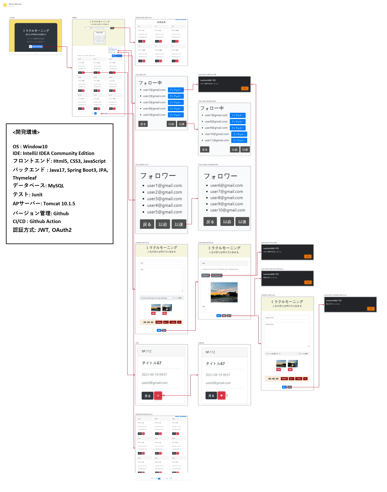

Application Name: Miracle Morning

- [&#8203;``oaicite:{"number":1,"invalid_reason":"Malformed citation 【Java&SpringBoot3】"}``&#8203; 早起きのWebアプリー機能追加（1）仕様書とスケジュール](https://note.com/songyh/n/ne22f8f456c40)
- [&#8203;``oaicite:{"number":2,"invalid_reason":"Malformed citation 【Java&SpringBoot3】"}``&#8203; 早起きのWebアプリー機能追加（2）「フォロー」機能（設計・実装・テスト)](https://note.com/songyh/n/n217fe01d6776)
- [&#8203;``oaicite:{"number":3,"invalid_reason":"Malformed citation 【Java&SpringBoot3】"}``&#8203; 早起きのWebアプリー機能追加（3）「いいね」機能（設計・実装・テスト)](https://note.com/songyh/n/n217fe01d6776)
- [&#8203;``oaicite:{"number":4,"invalid_reason":"Malformed citation 【Java&SpringBoot3】"}``&#8203; 早起きのWebアプリー機能追加（4）画像アプロード機能（設計・実装・テスト)](https://note.com/songyh/n/n05f5662c3a96)

## 画面遷移図

## 開発環境

- **OS:** Windows 10
- **IDE:** IntelliJ IDEA Community Edition
- **フロントエンド:**
  - HTML5
  - CSS3
  - JavaScript
- **バックエンド:**
  - Java 17
  - Spring Boot 3
  - JPA
  - Thymeleaf
- **データベース:** MySQL
- **テスト:** JUnit
- **APサーバー:** Tomcat 10.1.5
- **バージョン管理:** GitHub
- **CI/CD:** GitHub Actions
- **認証方式:** JWT, OAuth2

